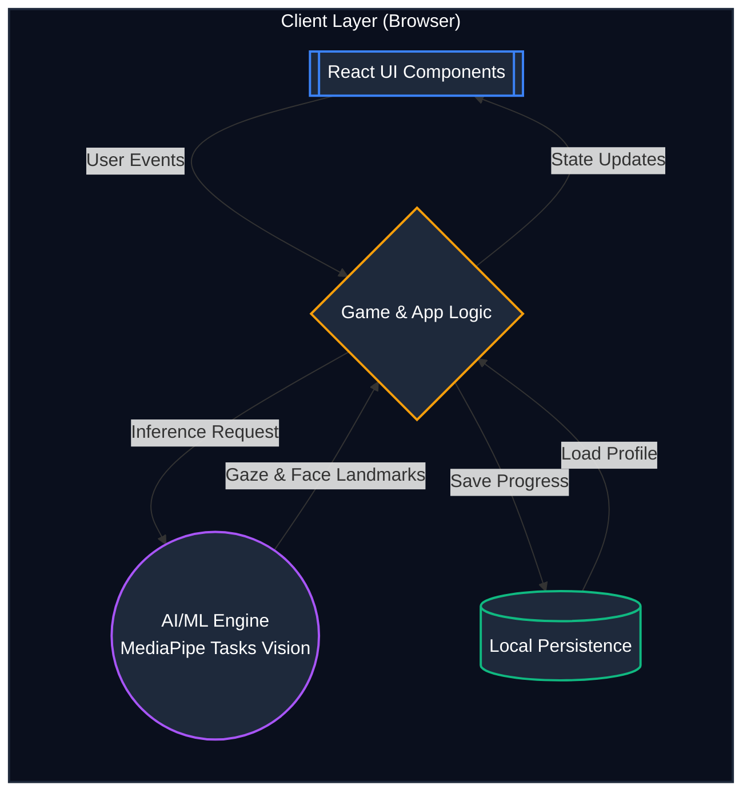

# Lock Focus
> **An Intent-Aware, Adaptive Cognitive Ecosystem**

[](https://opensource.org/licenses/MIT)
[](https://github.com/imarnv/lock-focus)
[](https://reactjs.org/)

**Lock Focus** is a privacy-first web platform designed to assess, track, and improve cognitive focus through adaptive AI and gamified neuro-feedback. It bridges the gap between static content and neurodiverse needs (ADHD/Dyslexia) using real-time attention signals.

---

## 🧠 The Problem vs. Solution

### The "Attention Gap"
Modern interfaces are rigid. They don’t know if you’re focused, distracted, or struggling. For users with **ADHD** or **Dyslexia**, this rigidity creates barriers:
*   **ADHD**: Drifting attention leads to missed information.
*   **Dyslexia**: Walls of text cause visual crowding and fatigue.

### Our Solution: "Intent-Aware" Computing
**Lock Focus** isn't just a tool; it's an **active participant**.
*   **Active Sensing**: Perceives attention state using privacy-first, local AI (Gaze Tracking).
*   **Reactive Adaptation**: Modifies content in real-time based on focus.
*   **Gamified Training**: Strengthens cognitive muscles through clinically-inspired loops.

---

## 🚀 Key Features

### 1. Neuro-Pilot (Focus Flow)
A high-intensity flow trainer that uses the Gaze Sensing engine for input.
*   **Gaze-Steered Gameplay**: The ship navigates based on your eye movement.
*   **Focus-Locked Progression**: The game pauses instantly if you look away.
*   **Neuro-Analytics**: detailed reports on attention span and reaction latency.

### 2. PeriQuest (Peripheral Vision Training) **[NEW]**
A dynamic reaction game designed to expand visual awareness.
*   **Central Fixation**: Users must keep eyes locked on the center.
*   **Peripheral Targets**: Detect and react to shapes appearing in the peripheral field.
*   **Heatmap Analysis**: Tracks "blind spots" and reaction speeds across the visual field.

### 3. ADHD Support Companion **[NEW]**
An AI-powered chatbot for executive function management.
*   **Task Breakdown**: Deconstructs overwhelming tasks into manageable steps.
*   **Prioritization**: Helps users organize their day based on energy levels.
*   **Coping Strategies**: Provides immediate, actionable advice for focus and emotional regulation.

### 4. Adaptive Reader & OCR
A reading environment that proactively responds to attention.
*   **Focus Dimming**: Text dims when you look away to save your place.
*   **Dyslexia Mode**: OpenDyslexic font and increased line spacing.
*   **Vision Stress Mode**: Reduces contrast and visual noise.

### 5. Vision Studio
Simulates neurodivergent experiences to foster empathy and understanding.
*   **ADHD Simulator**: Visualizes distraction and sensory overload.
*   **Dyslexia Simulator**: Demonstrates letter dancing and crowding.

---

## 🏗️ System Architecture

The ecosystem allows for modular interaction between the UI, Logic, and AI layers, all running client-side.



## 🔄 Data Flow Pipeline

A privacy-first pipeline where video feeds are processed instantaneously in memory with **Zero Data Transmission**.

```mermaid
sequenceDiagram
    autonumber
    participant Cam as 📷 Camera Feed
    participant MP as 🧠 MediaPipe (Face Landmarker)
    participant Engine as ⚙️ Gaze Engine
    participant App as 🎮 Focus Flow / Reader
    participant Store as 💾 LocalStorage
    
    Note over Cam, Store: 🔒 Privacy Barrier: Local-Only Processing
    
    Cam->>MP: Raw Video Frame (60fps)
    activate MP
    MP->>Engine: 478 Face Landmarks + Iris Data
    deactivate MP
    
    activate Engine
    Engine->>Engine: Calculate Pupil-to-Corner Ratio
    Engine->>Engine: Analyze Head Pose (Vector)
    Engine->>App: Gaze Coordinates (x, y) + Fixation State
    deactivate Engine
    
    activate App
    alt Focus Flow
        App->>App: Update Level Physics / Neuro-Pilot
    else PeriQuest
        App->>App: Verify Central Fixation
    else Adaptive Reader
        App->>App: Dynamic Opacity & Font Scaling
    end
    
    App-->>Store: Save Session Metrics (JSON)
    deactivate App
```



---

## 🛠️ Tech Stack

*   **Frontend**: React 18, Vite, Tailwind CSS, Framer Motion
*   **AI/ML**: MediaPipe (@mediapipe/tasks-vision), Tesseract.js (OCR)
*   **State Management**: React Context, LocalStorage
*   **Visualization**: Recharts, Canvas API
*   **Icons**: Lucide React

---

## 🔒 Privacy & Ethics

Lock Focus is built with **Privacy-by-Design**:
*   **Zero-Transmission**: Video streams never leave the browser; processing happens in-memory and is discarded immediately.
*   **No Biometrics**: We track mathematical vectors (points), not faces or identities.
*   **Opt-in Only**: Camera access is explicitly requested per session.

---

## 🏁 Getting Started

### Prerequisites
*   Node.js (v16+)
*   npm or yarn

### Installation

1.  **Clone the repository**
    ```bash
    git clone https://github.com/imarnv/lock-focus.git
    cd lock-focus
    ```

2.  **Install dependencies**
    ```bash
    npm install
    ```

3.  **Run the development server**
    ```bash
    npm run dev
    ```

4.  **Open in Browser**
    Visit `http://localhost:5173` to start using Lock Focus.

---

## 👥 Contributors

*   **[Yash Srivastava]** - *Lead Developer & AI Integration*
*   **[Team Members]** - *Frontend & Design*

---

*Built with ❤️ for the future of accessible computing.*
