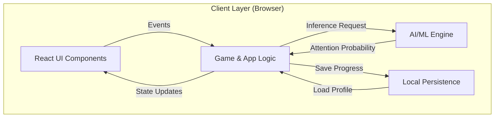
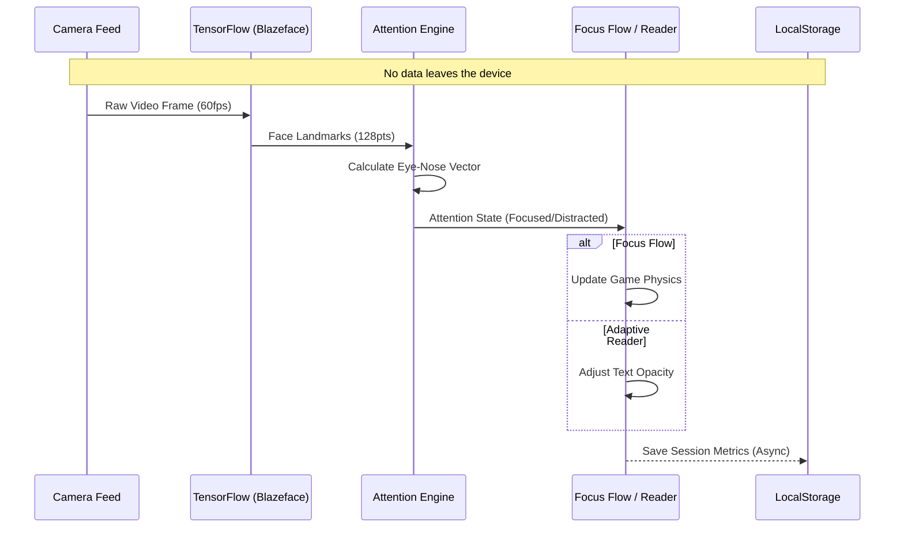

# Lock Focus
> **An Intent-Aware, Adaptive Cognitive Ecosystem**

Lock Focus is a privacy-first web platform designed to assess, track, and improve cognitive focus through adaptive AI and gamified neuro-feedback. It bridges the gap between static content and neurodiverse needs (ADHD/Dyslexia) using real-time attention signals.

---

## Architecture and Data Flow

Lock Focus runs entirely client-side to ensure privacy and low latency. It leverages persistent browser storage and local AI models.

## System Architecture

The ecosystem is built on a modular component architecture, ensuring separation of concerns between UI, Logic, and AI processing.



## Data Flow Pipeline

A privacy-first pipeline where video feeds are processed instantaneously in memory.



---

## Key Features

### 1. Head-Pose Gaze Sensing
The core of the ecosystem is a real-time gaze sensing engine powered by TensorFlow.js.
- **Mechanism**: Calculates head-pose by measuring horizontal nose-to-eye alignment using BlazeFace landmarks.
- **Accuracy**: Detects attention drift even when the user's face remains within the camera frame, providing a more realistic attention signal than simple face presence.

### 2. Focus Flow: Progression and Training
A high-intensity flow trainer that uses the Gaze Sensing engine for input.
- **Neuro-Pilot Mode**: The game steers itself as long as the user maintains focus.
- **Progression**: Five difficulty levels with scaling speed and session durations.
- **Persistence**: Level unlocks are stored locally to track long-term progression.

### 3. Chronos Match (Time Blindness Training)
A rhythm-based estimation game designed to improve internal clock accuracy for ADHD users.
- **Chaos Mode**: Simulates real-world distractions (notifications, thoughts) to train focus under pressure.
- **Scoring**: Uses high-precision timing to measure estimation accuracy against a target duration.
- **Streak System**: Rewards consistent timing with visual flair.

### 3. Neuro-Report Analytics
A post-session diagnostic dashboard that provides technical proof of cognitive performance.
- **Gaze Heatmap**: A spatial distribution map showing where the user's focus was physically directed.
- **Neural Latency**: Estimates reflex time based on peak performance speed.
- **Consistency Score**: Calculates the percentage of time spent in an optimal flow state.

### 4. Intelligent Adaptive Reader
A reading environment that proactively responds to the user's attention.
- **Attention Dimming**: Automatically dims and de-focuses text when an attention drift is detected.
- **OCR Support**: Converts static PDFs into accessible, gaze-reactive documents.

---

## Step-by-Step Walkthrough

### Step 1: Initialize the Application
1. Open the application at the deployed URL or `http://localhost:5173`.
2. Scroll to the "Vision Simulator" on the landing page to view ADHD and Dyslexia simulations.

### Step 2: Access the Dashboard
1. Click "Dashboard" to enter the ADHD-focused management area.
2. Note the focus metrics that track your session quality.

### Step 3: Test Gaze Sensing in Focus Flow
1. Navigate to Games -> Focus Flow.
2. Enable the camera through the privacy-first calibration modal.
3. Start a session in "Neuro-Pilot" mode.
4. Verify that turning your head away causes the "Attention Signal" on the HUD to shift to "Distracted" or "Away".

### Step 4: Review Gaze Analytics
1. Complete a session in Focus Flow.
2. Analyze the Gaze Heatmap on the Neuro-Report dashboard to see your fixation patterns.

### Step 5: Test the Adaptive Reader
1. Navigate to the Reader.
2. Enable "Neuro-Sensing" via the settings toolbar.
3. Observe how the text dims when you look away from the document.

---

## Project Structure

```bash
src/
├── components/        # Reusable UI elements (ProjectNavbar, VisionSimulator)
├── layouts/           # Page layouts (DashboardLayout)
├── pages/
│   ├── FocusFlow.jsx        # Neuro-Pilot Game Logic
│   ├── Dashboard.jsx        # ADHD Hub & Vision Studio
│   ├── AdaptivePdfReader.jsx # Accessibility Reader
│   ├── TimeBlindnessGame.jsx # Chronos Match
│   ├── ProjectPage.jsx      # Landing Page
│   └── ...
├── utils/             # Helper functions (storage.js)
└── App.jsx            # Routing & Entry Point
```

---

## Tech Stack

- **Frontend**: React (Vite), Tailwind CSS, Framer Motion
- **AI/ML**: TensorFlow.js (Blazeface model), Tesseract.js (OCR)
- **Visualization**: Recharts, Canvas API, Canvas Confetti
- **Icons**: Lucide React

---

## Privacy and Ethics

Lock Focus is built with privacy-by-design principles:
- **Local Processing**: All video data is processed entirely in the browser memory.
- **No Storage**: No video or images are stored or transmitted to any server.
- **User Consent**: Camera access is opt-in and handled via clear disclaimer modals.

## Security Features
1.  **Strict Content Security Policy (CSP)**:
    -   Restricts script sources to `'self'` and trusted providers (`unpkg`, `jsdelivr`).
    -   Blocks unauthorized object/frame injections.
2.  **Hardened Headers**:
    -   `X-Content-Type-Options: nosniff`: Prevents MIME-sniffing attacks.
    -   `Referrer-Policy: strict-origin-when-cross-origin`: Protects user navigation data.
3.  **Dependency Safety**:
    -   Minimal external dependencies, with verified CDNs for model loading.

---

## Setup Instructions

1. **Clone**: `git clone https://github.com/imarnv/lock-focus.git`
2. **Install**: `npm install`
3. **Run**: `npm run dev`
4. **Access**: `http://localhost:5173`
